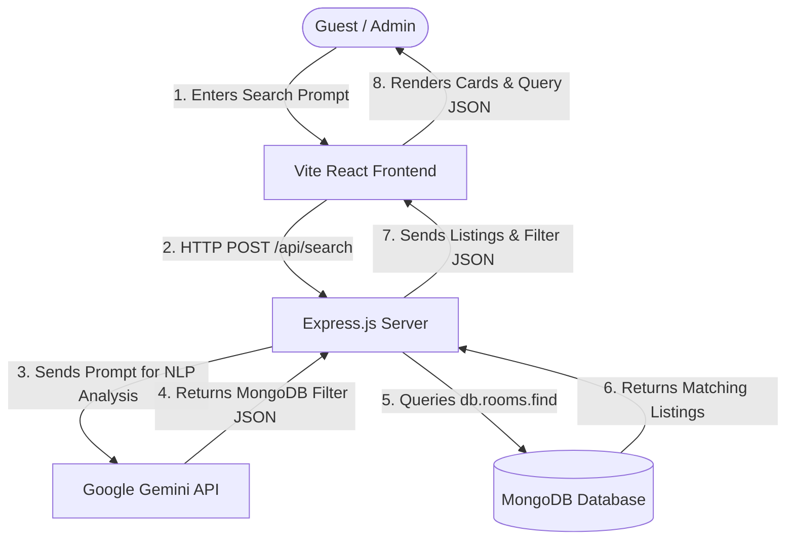

# PromptInn AI Booking Engine 🏨✨

PromptInn is a full-stack, AI-enhanced hotel booking platform. Instead of using traditional dropdown selectors and static sliders, users search for hotel rooms using natural language prompts (e.g., *"Find a cheap luxury hotel in Tokyo with pool and spa under $400"*). The application parses this prompt into structured MongoDB database queries via the **Google Gemini API**, fetches the matches from a live MongoDB collection, and renders them dynamically in a high-fidelity glassmorphic dashboard.

It also includes a full **Admin Console** that gives administrators full CRUD (Create, Read, Update, Delete) controls over listings, room details, amenities, pricing, and live inventory.

---

## 🚀 Key Features

*   💬 **Natural Language Booking**: Enter unstructured search terms to filter hotels.
*   🔍 **Interactive Query Visualizer**: Watch the exact MongoDB query (JSON syntax) compile in real-time as your prompt is parsed.
*   🛡️ **Admin Console**: Fully integrated CRUD workspace with metrics cards (listings, bookings,Vacancy, gross revenue), active room table, and booking log.
*   ⚡ **Stateful Context API**: Robust global state management handles role switches, loader states, search filters, and active bookings.
*   🔌 **Live MongoDB Database**: Connected via Mongoose models with atomic inventory decrements upon room reservation.
*   🎨 **Premium Glassmorphic Design**: Curated HSL colors, smooth hover animations, and dark-mode styling.

---

## 🛠️ System Architecture



---

## ⚙️ Quick Setup Guide

### 1. Prerequisites
Ensure you have [Node.js](https://nodejs.org/) (v16+) installed.

### 2. Configure Environment Variables
Create a `.env` file inside the `backend` directory based on the `.env.example` template:

```bash
# Go to promptinn-booking-engine/backend/ and create a .env file
PORT=5000
MONGODB_URI=your_mongodb_connection_string
GEMINI_API_KEY=your_gemini_api_key
```

#### Get Your Keys:
1.  **MongoDB Atlas URI (`MONGODB_URI`):**
    *   Sign up for a free account at [MongoDB Atlas](https://www.mongodb.com/cloud/atlas).
    *   Create a free **M0 Shared Cluster**.
    *   Click **Connect** -> **Drivers** and copy the connection string.
    *   Replace `<db_username>` and `<db_password>` with your database user credentials.
2.  **Google Gemini Key (`GEMINI_API_KEY`):**
    *   Go to [Google AI Studio](https://aistudio.google.com/).
    *   Click **Get API key** and click **Create API Key**.
    *   *Note: Gemini's developer tier is 100% free and requires no credit card details.*

### 3. Installation & Run
From the root project directory:

```bash
# 1. Install all dependencies across workspaces (root, frontend, backend)
npm run install-all

# 2. Run both Frontend and Backend concurrently in development mode
npm run dev
```

*   **Frontend Client:** Runs on [http://localhost:3000](http://localhost:3000)
*   **Backend Server:** Runs on [http://localhost:5000](http://localhost:5000)

*Note: If no Gemini API key is configured in the `.env` file, the backend will gracefully fallback to a high-fidelity local keyword/regex parser, allowing you to showcase the app immediately.*
